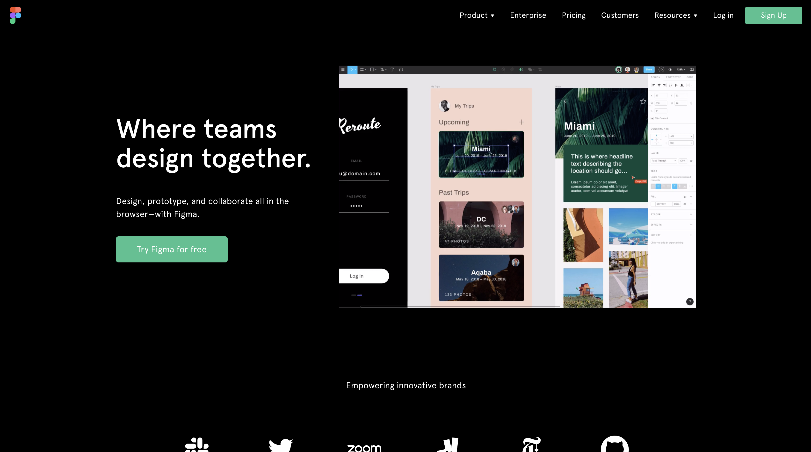
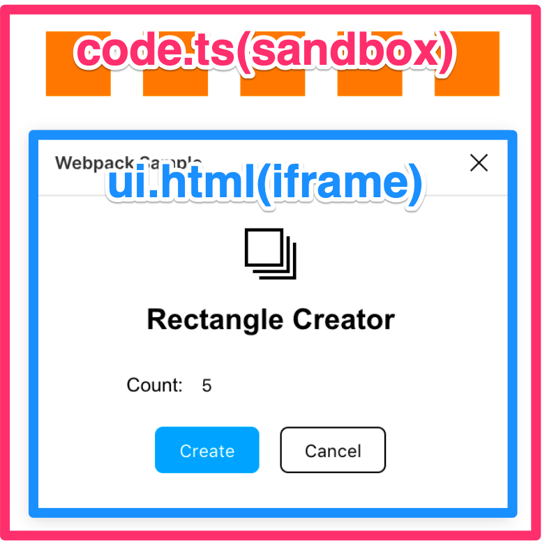

import { SelfIntroduce } from '../../components/SelfIntroduce'

<!-- sectionTitle: はじめてのFigma Plugin開発 -->

# 自己紹介

<SelfIntroduce />

---

<!-- sectionTitle: Figma Pluginっておいしいの？ -->

# Figmaって？

<br />

<div class="card-50">
  
  <ul class="flexblock activity">
    <li>最近勢いのあるデザインツール</li>
    <li>Web版・デスクトップアプリ版がある</li>
    <li>リアルタイム共同編集やURL共有が強み</li>
  </ul>
</div>

---

# じゃあFigma Pluginって？

<ul class="flexblock activity">
  <li>これまでもブラウザの拡張機能やWeb APIはあった</li>
  <li>Figmaのsandbox内で動作するのがPlugin</li>
  <li>2019年8月にリリースされたばかり</li>
</ul>

---

# 神々のPlugin

<ul class="flexblock activity">
  <li>
    Googleスプレッドシートのデータを一発で埋め込むやーつ
    <br />
    <a href="https://twitter.com/DavidWilliames/status/1156503669707161600">
      https://twitter.com/DavidWilliames/status/1156503669707161600
    </a>
  </li>
  <li>
    ディープラーニングで写真から人を消すやーつ
    <br />
    <a href="https://twitter.com/matamalaortiz/status/1163551129956954113">
      https://twitter.com/matamalaortiz/status/1163551129956954113
    </a>
  </li>
</ul>

---

# なんでFigma Pluginに興味を持ったか

<ul class="flexblock activity">
  <li>TypeScriptで書ける(型がある世界最高)&#x1F44D;</li>
  <li>業務で使ってるし、最近勢いがある&#x1F44D;</li>
  <li>動作の仕組みやデバッグ環境が面白い&#x1F44D;</li>
</ul>

---

<!-- sectionTitle: Figma Pluginをつくってみよう -->

# Pluginの仕組み


[How Plugins Run - Figma Developers](https://www.figma.com/plugin-docs/how-plugins-run/)

---
# ファイル構成

<br />

基本的に`code.ts`と`ui.html`を編集していく

<br />

```
.
├── README.md
├── code.js
├── code.ts
├── figma.d.ts
├── manifest.json
├── tsconfig.json
├── ui.html
```

---



---

# 36行で書いたプラグイン(DEMO)

---

```javascript
// ui.html
<p><input id="text" /> <button id="zoom">Zoom Text</button></p>
<p id="message"></p>
<p><button id="close">Close Plugin</button></p>

<script>
  document.getElementById('zoom').onclick = () => {
    const textbox = document.getElementById('text')
    const query = textbox.value
    parent.postMessage({ pluginMessage: { type: 'zoom', query } }, '*')
  }
  document.getElementById('close').onclick = () => {
    parent.postMessage({ pluginMessage: { type: 'close' } }, '*')
  }
  onmessage = event => {
    const message = document.getElementById('message')
    message.textContent = event.data.pluginMessage
  }
</script>
```
___

```javascript
// code.ts
figma.showUI(__html__)

figma.ui.onmessage = msg => {
  if (msg.type === 'zoom') {
    const searchNode = figma.currentPage.findOne(node => {
      return node.type === 'TEXT' && node.characters === msg.query
    })
    
    if (searchNode) {
      figma.viewport.scrollAndZoomIntoView([searchNode])
      figma.ui.postMessage('お探しのテキストが見つかりました👍')
    } else {
      figma.ui.postMessage('お探しのテキストは見つかりませんでした👎')
    }
  } else if (msg.type === 'close') {
    figma.closePlugin()
  }
}
```

___

<!-- sectionTitle: Figma Pluginの未来 -->

# 発展として...

<br />

普段のWeb開発のスキルがゴリゴリ使えて夢が広がる:sparkles:

<br />

<ul class="flexblock activity">
  <li>ビルドツールを使って複数ファイル構成</li>
  <li>ReactやVueで複雑なUIを構成</li>
  <li>外部APIとのコラボレーション</li>
</ul>

---

# ありがとうございました

___

# 参考にさせていただいたもの

<br />

- [introduction - Figma Developers](https://www.figma.com/plugin-docs/intro/)
- [figma/plugin-samples](https://github.com/figma/plugin-samples)
- [FigmaにPluginがついに来たのでよさそうなものをご紹介](https://note.mu/fjkn/n/n125c25962ba6)
- [Figma Pluginを作ろう！](https://speakerdeck.com/takanorip/making-figma-plugins-with-typescript)
